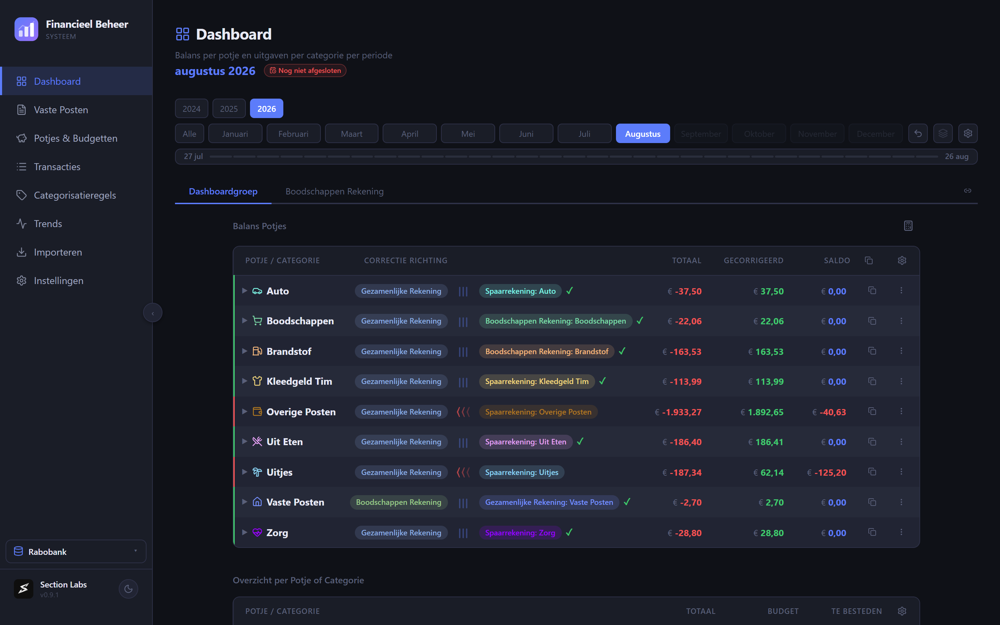
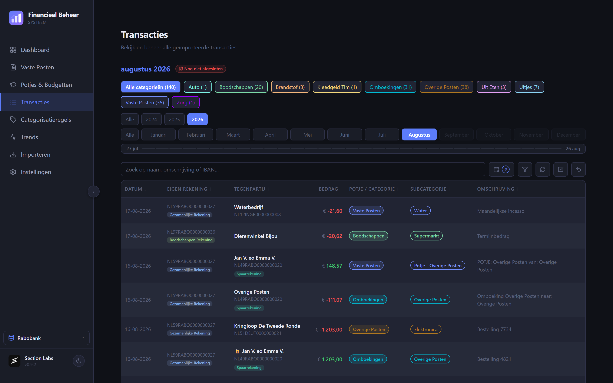
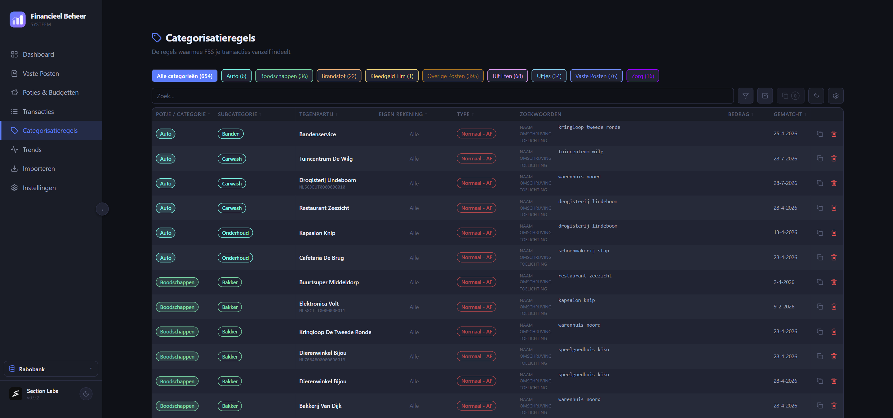
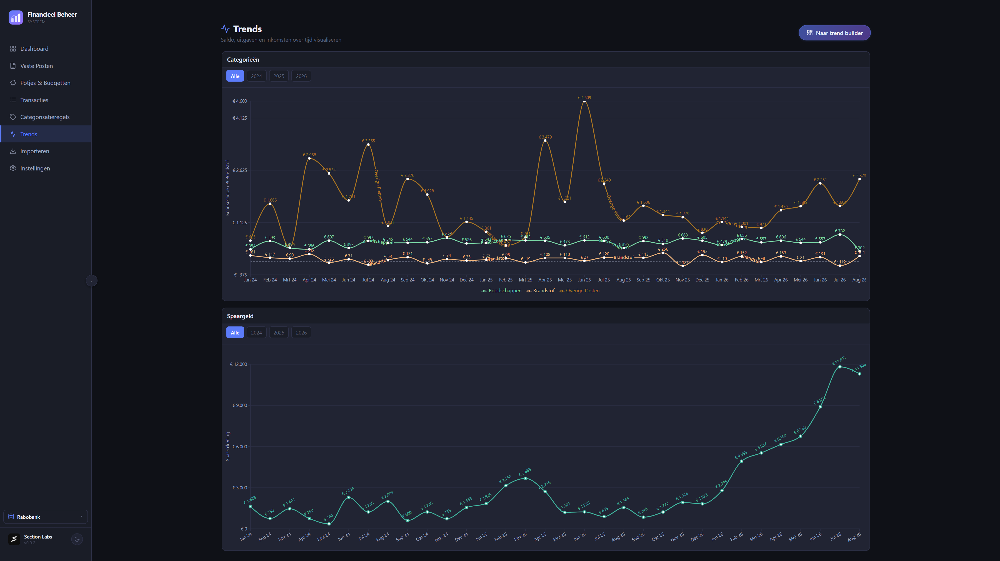
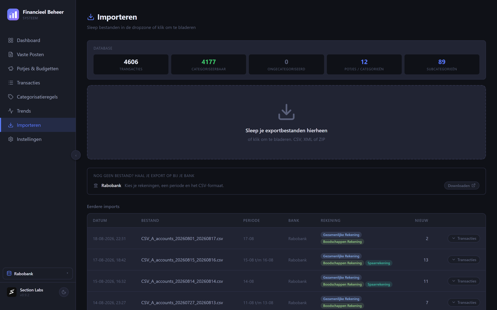

# FBS

**Zie waar je geld heen gaat, zonder dat iemand anders meekijkt.**

FBS is een Nederlandstalig programma voor je eigen financiën. Je leest de
bestanden in die je bij je bank downloadt, en FBS maakt daar een overzicht van:
wat er binnenkwam, waar het heen ging, wat er nog moet komen en wat je nog te
besteden hebt. Alles blijft op je eigen computer staan.

---

## Wat FBS voor je doet

### Je boekingen, ingedeeld

Elke boeking krijgt een categorie en een subcategorie. Dat hoef je maar één keer
per winkel of instantie te doen: FBS maakt er een regel van en deelt de volgende
keer vanzelf in. Splitsen kan ook, als één afschrijving over twee categorieën
gaat.

### Potjes en budgetten

Een potje is geld dat je apart zet voor iets: de auto, boodschappen, uitjes. Dat
kan een echte spaarrekening zijn, of alleen een bedrag dat je op papier opzij
zet. FBS houdt bij wat er werkelijk in zit en wat je er deze maand nog van over
hebt.

### Vaste lasten bewaken

Je huur, je verzekeringen, je abonnementen: FBS weet welke er elke maand horen
te komen, en laat zien welke al binnen zijn en welke nog niet. Wijkt een bedrag
af van vorige maand, dan zie je dat meteen.

### Regels die meegroeien

Alles wat je ooit hebt ingedeeld staat bij elkaar in één overzicht. Je kunt er
altijd iets in bijstellen, en die wijziging werkt door naar de boekingen die er
al bij hoorden.

### Terugkijken over langere tijd

Zet maanden en jaren naast elkaar en zie hoe je uitgaven zich ontwikkelen, per
categorie of over je spaargeld.

---

## Zo werkt het

1. **Je bestand inlezen.** Download bij je bank de export van je rekeningen en
   sleep hem in FBS. Rabobank en ABN AMRO worden herkend, in CSV, XML en ZIP.
   Boekingen die je al eerder hebt ingelezen worden overgeslagen, dus je kunt
   gerust een periode dubbel pakken.

   

2. **Je boekingen indelen.** Klik een regel aan en geef hem een plek. FBS stelt
   voor wat het al kent.

3. **Van een keuze een regel maken.** Bij het indelen kun je meteen zeggen: dit
   geldt voortaan altijd. De volgende import doet het dan zelf.

4. **Je vaste lasten bewaken.** Geef aan welke posten elke maand terugkomen. FBS
   houdt bij wat er binnen is en wat nog moet komen.

5. **Je potjes vullen.** Zet geld opzij voor doelen en zie wat er nog vrij te
   besteden is.

6. **Je maand bekijken en afsluiten.** Het dashboard laat zien waar je maand op
   uitkwam. Als hij voorbij is sluit je hem af, zodat de cijfers achteraf niet
   meer verschuiven.

Ben je nieuw, dan neemt FBS je bij de hand: de wegwijs-hulp loopt deze route met
je door en legt per scherm uit wat je er doet.

---

## Installeren

Haal de nieuwste versie op bij [Releases](../../releases).

- **Windows:** het installatiebestand uitvoeren.
- **macOS:** het schijfbestand openen en FBS naar Programma's slepen. Deze versie
  werkt op zowel Intel-Macs als Apple Silicon.

Daarna hoef je niets meer te downloaden: FBS meldt zelf wanneer er een nieuwe
versie is en werkt zichzelf bij. In de instellingen kies je of je de stabiele
versies wilt of ook de testversies.

---

## Alleen op je eigen computer, of op meer apparaten

FBS draait standaard helemaal op de computer waar je hem installeert. Je
gegevens staan in één bestand op die machine, en verder nergens.

Wil je vanaf meerdere apparaten met dezelfde gegevens werken, bijvoorbeeld een
laptop erbij, dan kun je FBS-Server draaien op je eigen NAS of server. De app
verbindt daar dan mee en iedereen ziet hetzelfde. Zie
[FBS-App-Server](../../../FBS-App-Server).

---

## Je gegevens blijven bij jou

Er gaat niets naar een dienst van iemand anders. Geen account, geen koppeling
met je bank, geen gegevens in een cloud. FBS leest de bestanden die jij zelf bij
je bank ophaalt, en bewaart het resultaat op je eigen apparaat.

Back-ups maakt FBS zelf, versleuteld, en je kunt er een tweede kopie van laten
wegschrijven naar een map die je zelf kiest. Terugzetten kan vanuit de app.

---

## Over deze repository

Hier staan de uitgebrachte versies en de bestanden waarmee de app zichzelf
bijwerkt. De broncode is niet openbaar.

Testversies staan in [FBS-App-Test](../../../FBS-App-Test).

---

Section Labs
