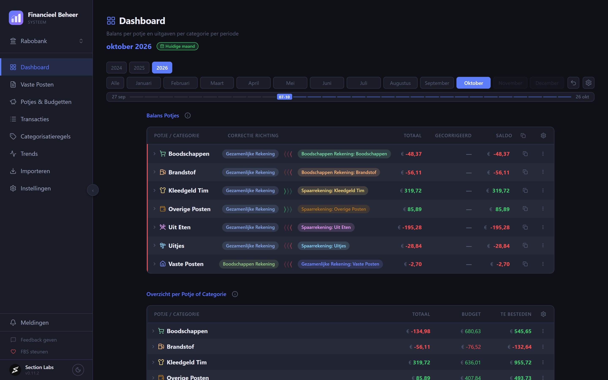
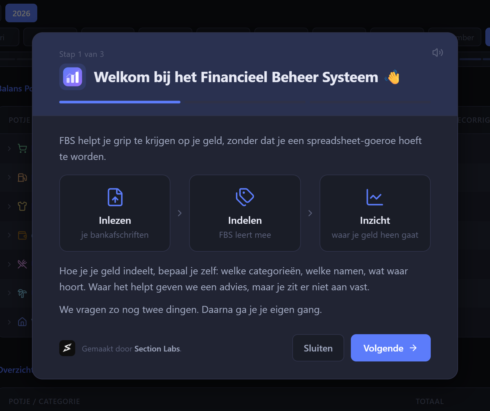
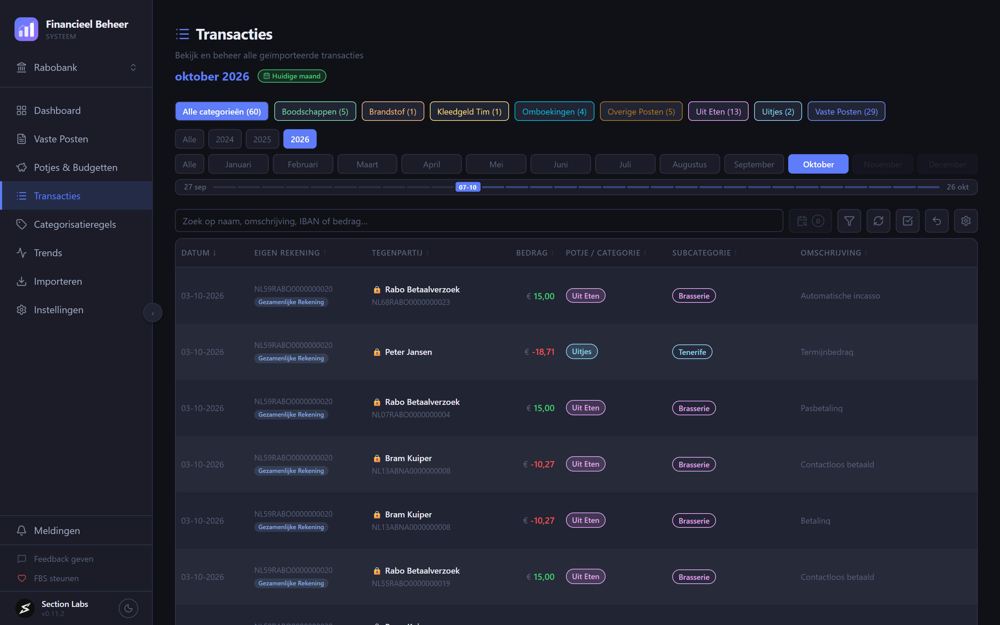
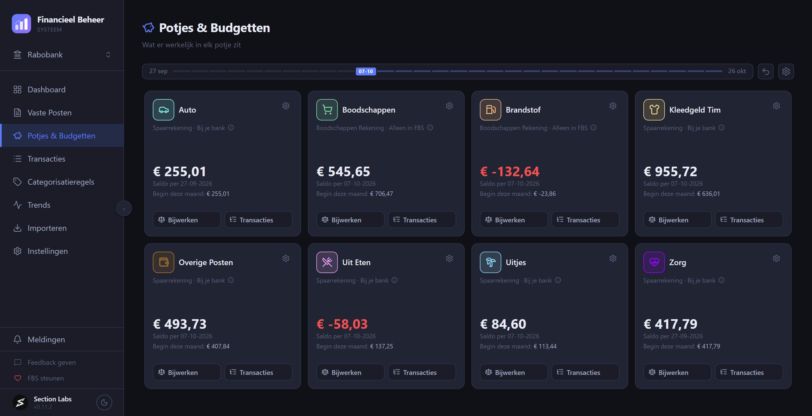
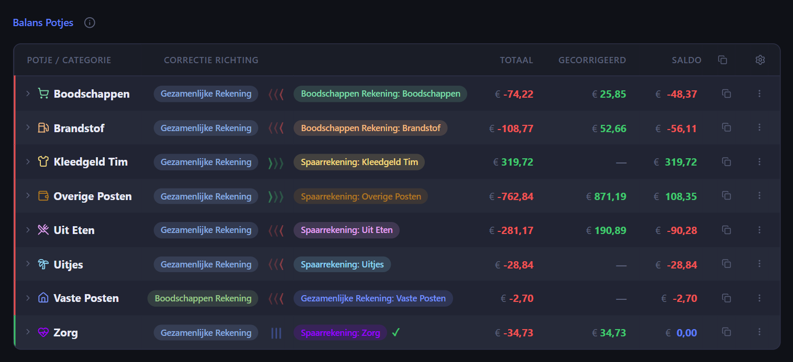
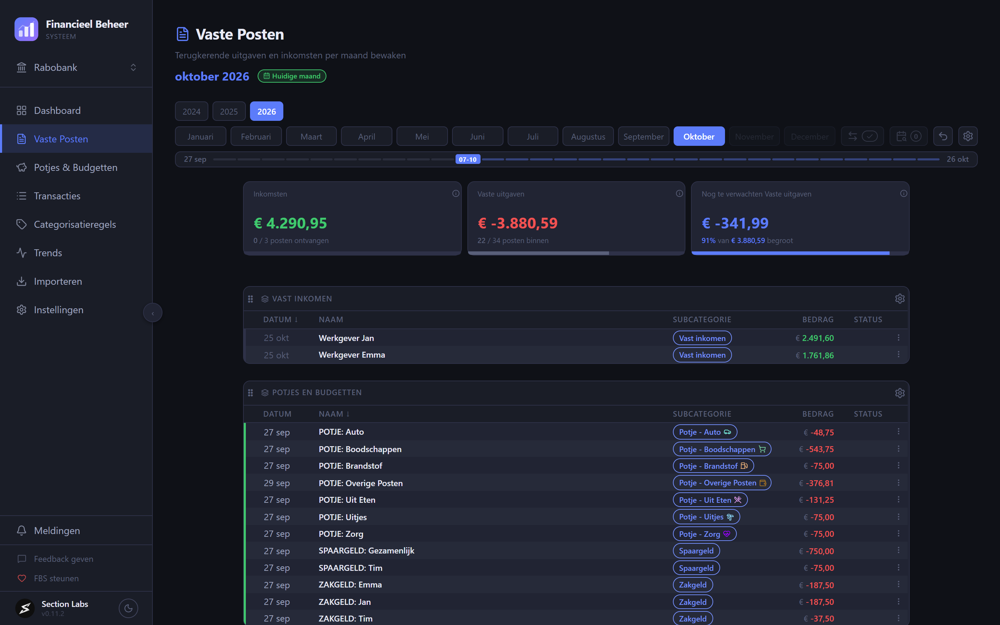
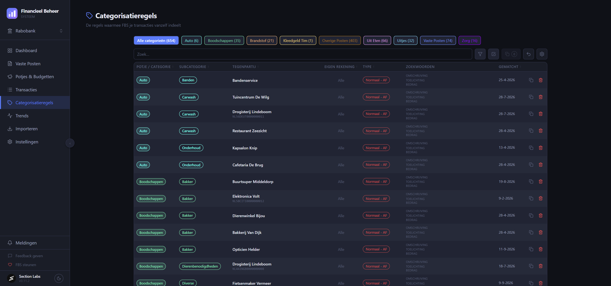
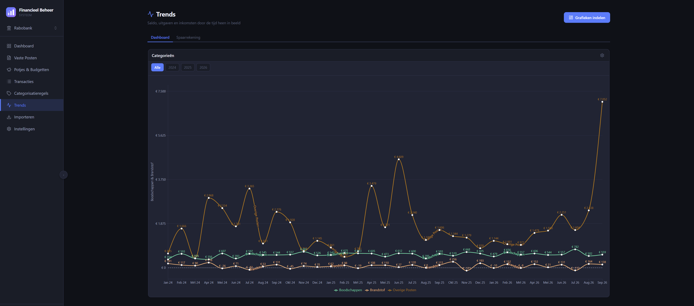
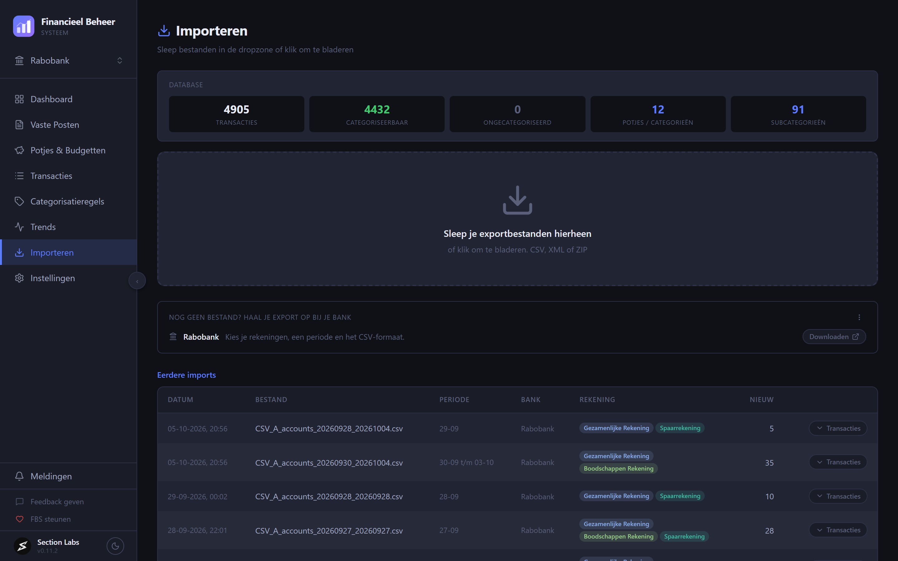

# FBS

**Grip op je geld, zonder spreadsheet-goeroe te zijn.**

FBS is een Nederlandstalig programma voor je eigen financiën. Je leest je
bankafschriften in, en FBS maakt daar een overzicht van:
wat er binnenkwam, waar het heen ging, wat er nog moet komen en wat je nog te
besteden hebt. Alles blijft op je eigen computer staan.

---

## Twee manieren van werken

Bij de eerste start kies je hoe je met FBS wilt werken. Overstappen kan altijd,
je gegevens blijven staan.

### Uitgavenbeheer (ons advies om mee te beginnen)

Je begint met het inlezen van je bankafschriften en het indelen van je
boekingen. De eerste keer is dat het meeste werk. Daarna wordt het elke maand
vanzelf minder, want wat je één keer indeelt, herkent FBS de volgende keer zelf.
Die keuzes bewaart FBS als categorisatieregels, die je altijd nog kunt
bijstellen.

Zodra je al je boekingen hebt ingedeeld, zie je op het Dashboard per categorie
waar je geld heen ging, en bij Vaste Posten welke vaste lasten er nog komen. Bij
Trends zie je hoe je uitgaven zich over de maanden ontwikkelen. Wil je later
vooruit plannen, dan heb je zo meteen de bedragen om mee te beginnen.

### Budgetbeheer

Met wat je bij Uitgavenbeheer over je uitgaven hebt geleerd, ga je je geld
vooruit verdelen over potjes. Je maakt ze één keer aan, het liefst ook als
spaarpotjes bij je bank, en koppelt elk potje aan een rekening. Een periodieke
overboeking op je maand start dag vult ze daarna elke maand vanzelf.

Elke maand lees je je bankafschriften in, ook die van je spaarrekening, en deel
je je boekingen in. Zodra je alles hebt ingedeeld, laat de tabel Balans Potjes
op het Dashboard per potje zien of het geld op de goede rekening staat. Heb je
een uitgave die bij een potje hoort met je betaalrekening betaald, dan zie je
daar hoeveel je van dat potje naar je betaalrekening moet overboeken. Aan het
eind van de maand sluit je hem af.

**Klinkt dit als veel?** Dat hoeft het niet te zijn. In FBS zelf word je stap
voor stap meegenomen: het welkomstscherm, de wegwijs-hulp en de tips leggen alles
uit op het moment dat je het nodig hebt.

---

## Wat FBS voor je doet

### Je boekingen, ingedeeld

Elke boeking krijgt een categorie en een subcategorie. Dat hoef je maar één keer
per winkel of instantie te doen: FBS maakt er een regel van en deelt de volgende
keer vanzelf in. Splitsen kan ook, als één afschrijving over twee categorieën
gaat.

### Potjes en budgetten (Budgetbeheer)

Een potje is geld dat je apart zet voor iets: de auto, boodschappen, uitjes. Dat
kan een echte spaarrekening zijn, of alleen een bedrag dat je op papier opzij
zet. FBS houdt bij wat er werkelijk in zit en wat je er deze maand nog van over
hebt.

### Balans Potjes: het verschil tussen de afspraak en de werkelijkheid (Budgetbeheer)

In het echt betaal je niet netjes per potje. De boodschappen gaan van de rekening
waar de pas bij hoort, de tankbeurt ook, en het geld dat je daarvoor opzij had
gezet staat ergens anders. Na een paar maanden klopt geen enkel potje meer met de
werkelijkheid, en je merkt het pas als je spaarrekening tegenvalt.

Balans Potjes laat precies dat verschil zien, per potje, in één tabel.

Lees hem van links naar rechts. Onder **Correctie richting** wijzen de pijlen van
de rekening waar je vandaan betaalde naar de rekening waar het geld hoort te
staan. **Totaal** is wat er deze periode vanaf de verkeerde kant is gegaan,
**Gecorrigeerd** is wat je al hebt rechtgezet, en **Saldo** is wat er nog open
staat.

Rechtzetten kost twee handelingen. Klik op het bedrag, dan staat het op je
klembord. Maak het bij je bank over tussen die twee rekeningen en zet de naam van
het potje in de omschrijving, precies zoals hij in FBS heet. De volgende keer dat
je inleest herkent FBS die overboeking, telt hem mee onder Gecorrigeerd, en loopt
het saldo vanzelf terug. Staat het op nul, dan verschijnt er een groen vinkje:
dat potje klopt weer. Laat je die naam weg, dan komt de overboeking gewoon bij je
overige posten terecht en deel je hem zelf in.

Je hoeft er niets voor bij te houden. De tabel komt uit dezelfde boekingen die je
al hebt ingelezen en ingedeeld, en klapt per regel open naar de boekingen
eronder, zodat je kunt zien waar een bedrag vandaan komt.

### Vaste lasten bewaken

Je huur, je verzekeringen, je abonnementen: FBS weet welke er elke maand horen
te komen, en laat zien welke al binnen zijn en welke nog niet. Wijkt een bedrag
af van eerdere maanden, dan zie je dat meteen. In Budgetbeheer rekent de
Budgetadviseur uit of je budgetten nog kloppen met wat er werkelijk binnenkomt
en uitgaat.

### Regels die meegroeien

Alles wat je ooit hebt ingedeeld staat bij elkaar in één overzicht. Je kunt er
altijd iets in bijstellen, en die wijziging werkt door naar de boekingen die er
al bij hoorden.

### Terugkijken over langere tijd

Zet maanden en jaren naast elkaar en zie hoe je uitgaven zich ontwikkelen, per
categorie of over je spaargeld.

---

## Zo werkt het

1. **Je bestand inlezen.** Download bij je bank de export van je rekeningen en
   sleep hem in FBS. Je bank wordt herkend, in CSV, XML en ZIP. Met echte
   bestanden getest zijn Rabobank en ABN AMRO; de andere zijn ingesteld volgens de
   openbare beschrijving van hun bestand, maar nog niet getest met een echt bestand.
   Boekingen die je al eerder hebt ingelezen worden overgeslagen, dus je kunt
   gerust een periode dubbel pakken.

   

2. **Je boekingen indelen.** Klik een regel aan en geef hem een plek. FBS stelt
   voor wat het al kent.

3. **Van een keuze een regel maken.** Bij het indelen kun je meteen zeggen: dit
   geldt voortaan altijd. De volgende import doet het dan zelf.

4. **Je vaste lasten bewaken.** Geef aan welke posten elke maand terugkomen. FBS
   houdt bij wat er binnen is en wat nog moet komen.

5. **Je potjes vullen.** Zet geld opzij voor doelen en zie wat er nog vrij te
   besteden is.

6. **Je maand bekijken en afsluiten.** Het dashboard laat zien waar je maand op
   uitkwam. In Budgetbeheer sluit je hem af als hij voorbij is, zodat de cijfers
   achteraf niet meer verschuiven.

Ben je nieuw, dan neemt FBS je bij de hand: de wegwijs-hulp loopt deze route met
je door en legt per scherm uit wat je er doet.

### Hulp onderweg

- **Tips:** ruim vijftig korte tips, elk bij de pagina waar ze over gaan. Hoe
  vaak je er een ziet, stel je zelf in.
- **Uitleg bij elk onderdeel:** achter het informatieteken bij tabellen, kaarten en
  instellingen staat wat een onderdeel doet.
- **Verteller:** liever luisteren? De verteller leest het welkomstscherm, de
  wegwijs-hulp en de tips voor, met een stem van je eigen computer. Er gaat geen
  tekst naar buiten.
- **Meldingen:** herinneringen die je zelf zet, seintjes bij het importeren, en
  een waarschuwing als er boekingen ontbreken tussen twee imports.
- **Feedback geven:** loop je ergens tegenaan of heb je een idee, dan stuur je
  dat vanuit FBS zelf, met een screenshot of een korte opname erbij.

---

## Installeren

Haal de nieuwste versie op bij [Releases](../../releases).

- **Windows:** het installatiebestand uitvoeren. Windows 10 of 11, 64-bit;
  getest op Windows 11.
- **macOS:** het schijfbestand openen en FBS naar Programma's slepen. Deze versie
  werkt op zowel Intel-Macs als Apple Silicon, met macOS 15 (Sequoia) of nieuwer;
  getest op macOS 15 en 26.

**Systeemeisen:**

- **Scherm:** minimaal 1280 × 720. Een hogere schaal van je computer of zoom in FBS
  maakt de ruimte kleiner: 1920 × 1080 op 150% is precies de grens.
- **Werkgeheugen:** 4 GB is ruim genoeg.
- **Schijfruimte:** ongeveer 250 MB, plus ruimte voor je back-ups.

Na de installatie hoef je niets meer te downloaden: FBS meldt zelf wanneer er een
nieuwe versie is en werkt zichzelf bij. In de instellingen kies je of je de
stabiele versies wilt of ook de testversies.

---

## Alleen op je eigen computer, of op meer apparaten

FBS draait standaard helemaal op de computer waar je hem installeert. Je
gegevens staan in één bestand op die machine, en verder nergens.

Wil je vanaf meerdere apparaten met dezelfde gegevens werken, bijvoorbeeld een
laptop erbij, dan kun je FBS-Server draaien op je eigen NAS of server. Die is
nog in bèta. De app verbindt daar dan mee en iedereen ziet hetzelfde. Zie
[FBS-App-Server](../../../FBS-App-Server).

---

## Je gegevens blijven bij jou

Er gaat niets naar een dienst van iemand anders. Geen account, geen koppeling
met je bank, geen gegevens in een cloud. FBS leest de bankafschriften die jij zelf
bij je bank downloadt, en bewaart het resultaat op je eigen apparaat. Alleen als
jij ervoor kiest, gaat er iets naar buiten: een back-up naar je eigen cloudmap,
of feedback die je zelf verstuurt.

Back-ups maakt FBS zelf, bij het starten en afsluiten. Je kunt er een tweede
kopie van laten wegschrijven naar een map die je zelf kiest, zoals een USB-stick,
je NAS of je eigen cloudmap, desgewenst versleuteld met een wachtwoord. Terugzetten kan vanuit de app.

---

## Over deze repository

Hier staan de uitgebrachte versies en de bestanden waarmee de app zichzelf
bijwerkt. De broncode is niet openbaar.

---

Section Labs
